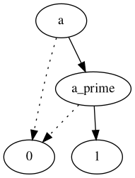
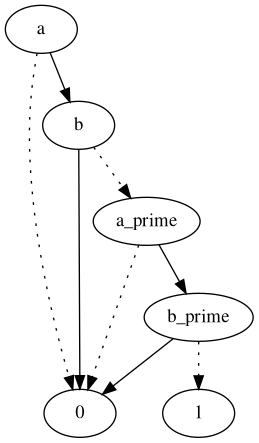
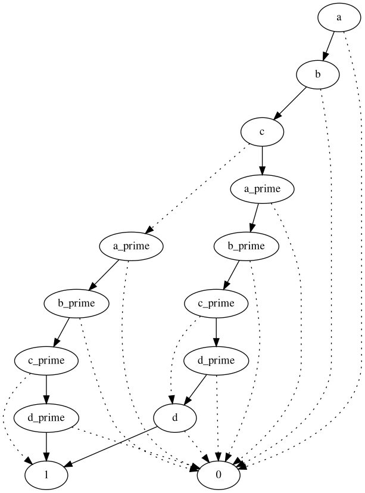

# Finding the Incomparability Function Systematically with DIG

## Observation

In an environment where the dominance relation is defined as a comparator of two candidate solution (A and B), the condition for incomparability function to hold requires both A dominates B and B dominates A. 

Taking A dominates B and B dominates A as logical formula, a procedure can be defined to achieve which logical bits in A and B are required to hold true or false.

## In Mining Context

In our context, the two candidate solutions which are compared become one candidate solution A, any previously found solution fromSol(A). Thus, we can we can take the logical  
``` 
A dominates fromSol(A) /\ fromSol(A) dominates A  
```

## Simplifying the Logical Formula with Laws/BDD

The expression can later simplified by applying logic laws or via generating a BDD and finding an equivalent simple BDD. From this simplified expression, assignments for the chosen terminal points can be deducted to find the full incomparability function.

## Implementation

An implementation of the system is done via a boolean expression manipulation library which allows BDD representation and also SAT compatibility for solving stage.

- The implementation parses the **dominance_relation** in Essence specification and construct the dominance nogood as a logical expression. In this step, the dominance is interpreted as a propositional formula and anything more complex than that is directly taken as a terminals. 
- The counterpart of the dominance expression is determined via A<>B replacement and then two expressions are put in an and clause.
- The propositional logical formula is simplified by either laws or by constructing BDD.
- SAT solver is called for a working assignment if possible. (BDD graph can also be exported around this stage).
- The program outputs the final resolution expression with the sat assignment in a json format.
- From this moment, the user can look at the result of the program and conclude with the necessary semantic analysis. 

## Examples

### Maximal Frequent Itemset Mining - Same

The easiest example in mining context can be given as maximal frequent itemset mining (mfis).

In this problem class, the dominance nogood is defined as:
```
dominance_relation !(fis subsetEq fromSolution(fis))
```
So the dominance expression and its transpose
```
fis subsetEq fromSolution(fis)
fromSolution(fis) subsetEq fis
```
Since they are the smallest we can represent them in propositional logic we can name name them the terminals $a$ and $a'$.

```
{
    "translation_table": {
        "a": "freq_items[1] subsetEq from_solution_freq_items[1]"
    },
    "resolve_with_bdd": false,
    "resolution_expression_str": "And(Terminal(\"a\"), Terminal(\"a_prime\"))",
    "sat_assignment": {
        "a": true
        "a_prime": true,
    }
}
```

Even though in this case, it's really unnecessary,  we can also look at the BDD: 



Even if it was obvious the result says that $a$ and $a'$ both should be true. That means a candidate solution must be a supersetEq and a subsetEq at the same time. That condition can only hold where the both candidate and previously found solution are have same cardinality.   
```
incomparability_function descending |freq_items[1]|
```

### Closed Frequent Itemset Mining - Still Same

In this problem class, the dominance nogood is defined as:
```
dominance_relation (freq_items[1] subsetEq fromSolution(freq_items[1])) -> (freq_items[2] > fromSolution(freq_items[2]))
```
in which the first operation can be represented as $a$ and the second one with $b$.

The solution is:
```
{
    "translation_table": {
        "a": "freq_items[1] subsetEq from_solution_freq_items[1]",
        "b": "freq_items[2] > from_solution_freq_items[2]"
    },
    "resolve_with_bdd": false,
    "resolution_expression_str": "And(And(Terminal(\"a\"), Not(Terminal(\"b\"))), And(Terminal(\"a_prime\"), Not(Terminal(\"b_prime\"))))",
    "sat_assignment": {
        "a_prime": true,
        "a": true,
        "b": false,
        "b_prime": false
    }
}
```
Again the optional BDD:



The final expression is $a$ /\ $a'$ /\ $¬b$ /\ $¬b'$ which translates into:
    - The candidate solution should be subsetEq or supersetEq of the prev solution and 
    - Neither of the solutions can have greater cardinality.

This boils down to the same argument of they should have the same cardinality.
```
incomparability_function descending |freq_items[1]|
```

### Relevant Subgroups Discovery - Things are changing

This is the most complex dominance we have and it is:
```
dominance_relation !((freq_items[cover_pos] subsetEq fromSolution(freq_items[cover_pos])) 
    /\ ( freq_items[cover_neg] supsetEq fromSolution(freq_items[cover_neg]) )
    /\ ((freq_items[cover_pos] union freq_items[cover_neg] 
        = fromSolution(freq_items[cover_pos]) union fromSolution(freq_items[cover_neg]) ) 
        -> (freq_items[itemset] subsetEq fromSolution(freq_items[itemset]) )))
  
```

Since this problem consists class information on transactions, the final pattern is also examined in positive coverage and negative coverage thus the number of variables in the equation is increased.

After the resolution the expression becomes as such:
```
{
    "translation_table": {
        "a": "freq_items[cover_pos] subsetEq from_solution_freq_items[cover_pos]",
        "b": "freq_items[cover_neg] supsetEq from_solution_freq_items[cover_neg]"
        "c": "freq_items[cover_pos] union freq_items[cover_neg] = from_solution_freq_items[cover_pos] union from_solution_freq_items[cover_neg]",
        "d": "freq_items[itemset] subsetEq from_solution_freq_items[itemset]",
    },
    "resolve_with_bdd": false,
    "resolution_expression_str": "Or(Or(And(And(And(Terminal(\"a\"), Terminal(\"b\")), Not(Terminal(\"c\"))), And(And(Terminal(\"a_prime\"), Terminal(\"b_prime\")), Not(Terminal(\"c_prime\")))), And(And(And(Terminal(\"a\"), Terminal(\"b\")), Not(Terminal(\"c\"))), And(And(Terminal(\"a_prime\"), Terminal(\"b_prime\")), Terminal(\"d_prime\")))), Or(And(And(And(Terminal(\"a\"), Terminal(\"b\")), Terminal(\"d\")), And(And(Terminal(\"a_prime\"), Terminal(\"b_prime\")), Not(Terminal(\"c_prime\")))), And(And(And(Terminal(\"a\"), Terminal(\"b\")), Terminal(\"d\")), And(And(Terminal(\"a_prime\"), Terminal(\"b_prime\")), Terminal(\"d_prime\")))))",
    "sat_assignment": {
        "a": true,
        "a_prime": true,
        "b": true,
        "b_prime": true
        "c": false,
        "c_prime": false,
    }
}
```
The resolution expression in BDD form:



From BDD, we can see that there are actually 3 possible assignments. However, on a closer examine, we can see that 2 of these possible solutions require either $c$ /\ $¬c'$ or $¬c$ /\ $c'$. Since $c$ terminal dictates that (fis+ union fis-) (which is the whole fis actually) = fromSol(fis+ union fis-), $c'$ is the same as $c$ thus the opposite assignments for $c$ and $c'$ are not possible.

The only assignment combination which puts $c$ and $c'$ in the same assignment which also puts them on **false** thus, the candidate solution can actually be different then the prev solution. This assignment combination actually doesn't care about $d$ and that actually means the incomparability_function actually doesn't necessarily rely on the cardinality of the whole itemset.

The final expression actually comes to the point of positive covers are having the same cardinality and the negative covers are having the same cardinality. Since the incomparability_function function support multiple layers, we can put them in either order and achieve:

```
incomparability_function descending [|freq_items[cover_pos]|, |freq_items[cover_neg]|]
```

## Experiments on new incomparability_function for RSD

On one dataset (tumor) and different frequency thresholds, the newly defined incomparability function performs similar in terms of node count. However, the number of solver calls can increase drastically. 

The cardinality of the fis is exposed to another variable so that preprocessing can shrink its domains. On previous incomparability_function, this allows system to perform 14 solver calls in total (for one particular freq) for 14 different itemset cardinalities.

However, without exporting positive and negative cardinalities, the system wants to perform the combination of 255 x 75 = 19125 solver calls which is unreachably large and while trying to benefit from perfect incomparability_function, it can actually generate unnecessary overhead.

After exporting the positive and negative cardinalities, the number of solver calls drops down to 100 x 70 = 7000. This number is still large but that's an improvement. Other preprocessing options can be tried. In my experiments, using a more strict preprocessing SSAC resulted in one dimension in multi layer incomparability to disappear sometimes and my multi layer incomparability function doesn't perform accordingly as far as I see which resulted in crashes. This shows the multi layer incomparability function code is not well tested (which it is indeed) and it is not mature (yet).
